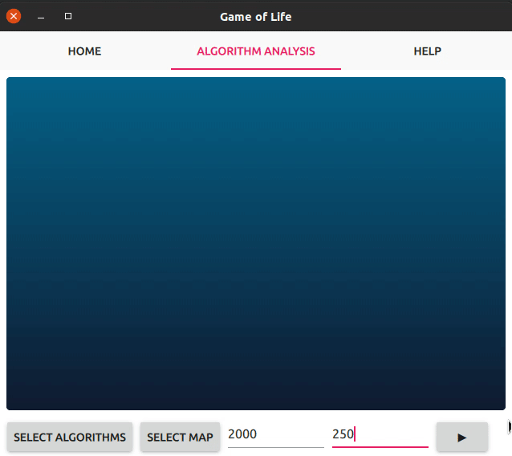

# Game Of Life

__Summary:__

The goal of this project is to implement Game Of Life with several algorithms, and measure efficiency each of them. [Game Of Life](https://en.wikipedia.org/wiki/Conway%27s_Game_of_Life)

## How to build:

### Following libs must be installed:
```sh
sudo apt-get install -y libboost-all-dev qml-module-qtcharts mpich qtquickcontrols2-5-dev qml-module-qt-labs-platform qml-module-qtquick-dialogs
```

### Library required for tests:
```sh
sudo apt install libgtest-dev
```
Also read this [manual](https://medium.com/@rvarago/introduction-to-google-c-unit-testing-3d564c30f3b0) for details.

### How to build algorithms:
```sh
cd Algorithms
make -j4
```
#### Also you can build serial, mpi or concurrent algorithm separately.
```sh
make serial -j4
make concurrent -j4
make mpi -j4
```
#### To run algorithm you should use this flags:
> -f - stands for file with Game Of Life map
> 
> -n - number of generations to live
> 
> -v - verbosity level
> 
> Example: `./game_of_life_mpi -f ../Patterns/puffer-train-big.txt -n 2000 -v 0`

### How to build GUI application:
```sh
cd Application
mkdir build
cd build
/your/Qt/path/qmake ../Application.pro -spec linux-g++ CONFIG+=qtquickcompiler
make -j4
```
Run
```sh
./Application
```

## How to use application:
In App you can create random map, load map from file or safe to file.
Here is the example of random run:


Also you can implement your own algo in `Algorithms` dir and analyze it with default ones.
Example of run default ones:


